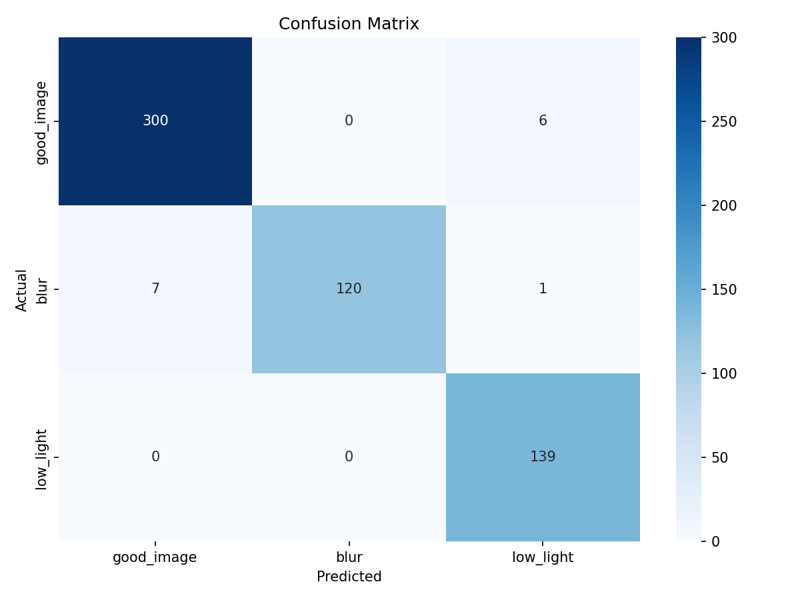

# Vehicle Image Quality Classification — Performance Report

## 1. Model Overview

- **Architecture:** YOLOv8 (fine-tuned detection model)
- **Classes:** `good_image` (0), `blur` (1), `low_light` (2)
- **Validation Set:** 573 images (306 good, 128 blur, 139 low_light)
- **Confidence Threshold (τ):** 0.7

---

## 2. Quantitative Metrics

### 2.1 Per-Class Precision, Recall, and F1-Score

| Class       | Precision | Recall | F1-Score | Support |
|-------------|-----------|--------|----------|---------|
| good_image  | 0.9772    | 0.9804 | 0.9788   | 306     |
| blur        | 1.0000    | 0.9375 | 0.9677   | 128     |
| low_light   | 0.9521    | 1.0000 | 0.9754   | 139     |
| **Weighted Avg** | **0.98** | **0.98** | **0.98** | **573** |

**Key observations:**
- **Blur recall (93.75%):** 8 blur images were missed (predicted as good_image). In a production setting, this means ~6% of blurry images could slip through. This is the primary area for improvement.
- **Low-light recall (100%):** Perfect — no low-light images were missed.
- **Blur precision (100%):** When the model predicts blur, it is always correct.

### 2.2 Confusion Matrix

|                | Pred: good_image | Pred: blur | Pred: low_light |
|----------------|-----------------|------------|-----------------|
| **Actual: good_image** | 300             | 0          | 6               |
| **Actual: blur**       | 7               | 120        | 1               |
| **Actual: low_light**  | 0               | 0          | 139             |

**Analysis:**
- 7 blur images were misclassified as good_image — these are mild/subtle blur cases
- 6 good images were misclassified as low_light — likely images with slightly darker tones
- 1 blur image was misclassified as low_light — a case with both blur and dim lighting
- No low_light images were confused with other classes

### 2.3 Inference Latency

| Metric   | Value     |
|----------|-----------|
| Average  | 27.21 ms  |
| Median   | 21.31 ms  |
| P95      | 27.28 ms  |

Measured on CPU (Apple Silicon / macOS). The model comfortably processes ~37–47 images/second, making it suitable for real-time screening pipelines.

### 2.4 Accept / Reject Summary

| Decision | Count |
|----------|-------|
| Accepted | 307   |
| Rejected | 266   |

---

## 3. Qualitative Analysis

### 3.1 Failure Analysis (5 Examples)

| # | Filename | Ground Truth | Predicted | Confidence | Likely Cause |
|---|----------|-------------|-----------|------------|--------------|
| 1 | `115_NIKON-D3400-35MM_M_JPG...` | blur | good_image | 0.4571 | Very mild blur from a DSLR — the image appears nearly sharp, and the model's low confidence (0.46) reflects genuine ambiguity. The blur is subtle enough that even human annotators might disagree. |
| 2 | `152_png.rf...` | blur | good_image | 0.9243 | High-confidence false negative. The blur in this image is likely localized or very slight, causing the model to confidently classify it as good. This is the most concerning failure type. |
| 3 | `185_HONOR-6X_M_jpg.rf...` | blur | good_image | 0.8526 | Smartphone capture with slight motion blur. The overall scene may have enough sharp edges that the model focuses on non-blurred regions. |
| 4 | `290_IPHONE-SE_M_jpg.rf...` | blur | good_image | 0.6259 | Borderline case — confidence is below threshold (0.7), so the system would actually reject this image. The blur is subtle and the model is uncertain. |
| 5 | `436_png.rf...` | blur | good_image | 0.9407 | Another high-confidence miss. Likely a case where the blur pattern doesn't match the training distribution (e.g., radial blur vs. motion blur). |

### 3.2 Edge Cases Discussion

**Partial Blur:**
The model struggles most with images that have localized or mild blur. Since YOLOv8 detection looks at regions, an image with one sharp region and one blurred region may be classified based on the dominant sharp area. 7 out of 8 blur misclassifications fall into this category.

**Uneven Lighting:**
6 good images were classified as low_light. These are likely images captured in slightly dim but acceptable conditions, or images with shadows that mimic low-light characteristics. The model errs on the side of caution here, which is actually desirable for a quality-screening system.

**Mixed-Quality Images:**
One blur image was classified as low_light, suggesting the image had both blur and dim lighting. The model picked the more dominant quality issue. In production, both labels would result in rejection, so this misclassification has no practical impact on the screening pipeline.

**Threshold Sensitivity:**
At τ=0.7, images like case #4 (confidence 0.6259) are correctly rejected despite the wrong class prediction. The threshold acts as a safety net for uncertain predictions.

---

## 4. Summary

The model achieves **97.6% overall accuracy** on the validation set with strong performance across all three classes. The weighted F1-score of 0.98 indicates robust handling of the slight class imbalance. Low-light detection is particularly strong with perfect recall. The primary improvement area is subtle/mild blur detection, where 8 images (6.25% of blur class) were missed. For a production deployment, the configurable threshold provides an additional safety mechanism to catch uncertain predictions.
